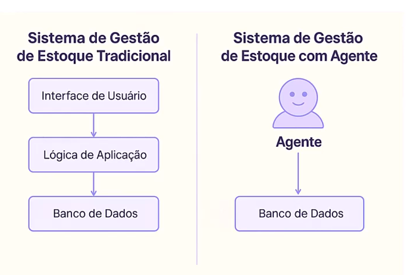
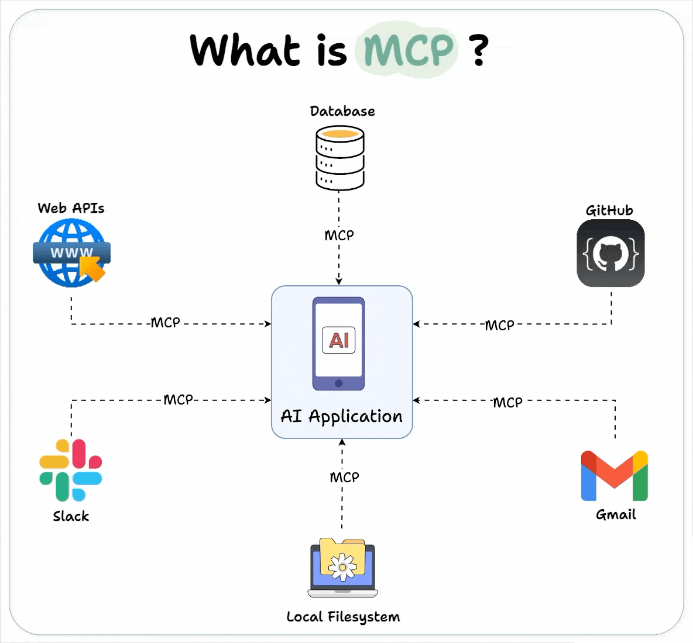
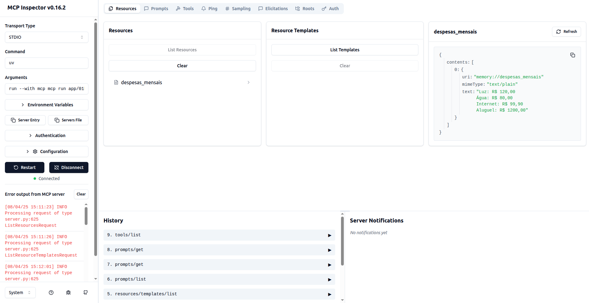

# Tutoriais:

1- Criação de um servidor MCP próprio e depuração

-   Caminho: app/01MCPServer/server.py

2-Criação do cliente MCP (uma aplicação que vai executar o servidor MCP )

-   Caminho: app/02MCPClient/class/mcp_client.py
-   Ter clientes que possa executar o servidor mcp criado

# Guia do Model Context Protocol (MCP)

## ✅ O que é **Agentes**

-   Aplicações baseadas em LLms
-   Tem capacidade de ação
-   Mantém contexto e memória
-   Possui autonomia

Revolução no desenvolimento de aplicações pois as aplicações além de regras estáticas tem inteligência real. Capacidade de resolver problemas reias com linguagem natural.

| Aspecto      | Aplicações Tradicionais          | Agentes                                   |
| ------------ | -------------------------------- | ----------------------------------------- |
| Interfaces   | Botões, formulário, regras fixas | Linguagem natural                         |
| Ações        | Pré-programadas e lineares       | Decididas dinamicamente                   |
| Integrações  | Manuais e frágeis                | Orquestramento de várias ferramentas      |
| Inteligência | Lógica complexa e limitada       | Inteligência sofisticada de forma simples |



Os agentes estão revolucionando a forma como as aplicações estão sendo desenvolvidas.

### Agente com llm + mcp:

Ex.: listar os produtos que estão abaixo do mínimo no setor e gere uma ordem de reposição.

-   Então o agente vai usar o LM para interpretar.
-   Vai consultar o banco de dados com agente
-   Vai chamar um endpoint para criar o pedido automaticamente.

## ✅ O que é **MCP** (Model Context Protocol)

-   Formato de dados padronizados para interação com LLMs.

**MCP (Model Context Protocol)** é um protocolo open-source criado pela **Anthropic** para **padronizar como grandes modelos de linguagem (LLMs)** se conectam com **ferramentas externas, APIs, bancos de dados e outros recursos**.



### ✨ Características principais:

-   **Protocolo baseado em JSON-RPC 2.0**: Comunicação padronizada entre cliente e servidor
-   **Transporte flexível**: Suporta stdio, HTTP e WebSocket
-   **Tipagem rigorosa**: Schemas JSON bem definidos para todas as mensagens
-   **Handshake de inicialização**: Negociação de capabilities entre cliente e servidor
-   **Gerenciamento de recursos**: Permite exposição de tools, resources e prompts

> 📦 **Importante**: MCP não é apenas uma "estrutura de mensagem", mas um protocolo completo com especificações rigorosas para comunicação entre sistemas.

Claro! Aqui vai uma explicação simples e objetiva para cada item:

---

### 🧠 **Cliente MCP (Model Context Protocol):**

É a **aplicação que faz a pergunta ou envia uma solicitação** para o modelo de linguagem.
Exemplo: um chatbot no site que o usuário usa para conversar com a IA.

Podemos criar o ser

---

### 🧠 **Servidor MCP:**

É a **aplicação que recebe a solicitação do cliente**, **prepara o contexto**, chama o modelo de linguagem e devolve a resposta.
Ele cuida da lógica e das integrações com ferramentas externas, memória, regras, etc.

---

É o **cérebro** que:

1. **Recebe o pedido** do cliente (ex: pergunta do usuário),
2. **Prepara o contexto** (ex: histórico da conversa, ferramentas disponíveis),
3. **Chama o modelo de linguagem** (como GPT),
4. **Devolve a resposta** para o cliente.

---

#### 🔧 Usa:

-   **Tools**: ferramentas externas (ex: calculadora, busca web, APIs).
    -   Tools: funções executáveis que o llm pode decidir usar
    -   @mcp.tools
-   **Resources**: memória, dados, histórico da conversa.
    -   Disponibilizas ao LLM antes da resposta
    -   Controlado pelo cliente, mas o LLM vendo o recurso decide usá-lo
    -   Tipos: texto e binários (imagem, aúdio, vídeo)
    -   Exemplo: conteúdo de arquivos, dados de banco de dados, iamgens e etc.
-   **Prompt**: o texto enviado ao modelo com instruções e contexto.
    -   Forma d epadronizar interação com LLMs
    -   Template
    -   @mcp.prompt



Modo depuração do MCP Server

#### Docstring: através do docstring o servidor saberá o que a tools faz e pode decisir se vai usar ou não

```python
"""
texto corrido...
"""
```

---

#### 🔗 Protocolos:

-   **Stdio**: comunicação local (como rodar um programa e enviar/receber via terminal).
-   **HTTP com SSE (Server-Sent Events)**: comunicação via internet **em tempo real**, enviando as respostas **em partes** conforme o modelo responde.

---

Se quiser, posso mostrar um fluxo com essas etapas ou um exemplo em código.

---

### ⚙️ **Frameworks de Agentes:**

#### **LangChain:**

Uma biblioteca que **facilita a criação de agentes de IA** conectando modelos de linguagem com ferramentas (como banco de dados, APIs, etc.) e adicionando memória, lógica e fluxos personalizados.

-   Chains, tools, retrieval, memory, templatses, parsers

#### **LangGraph:** (processo de decisão)

Extensão do LangChain para **criar fluxos mais estruturados** com **controle de estados** (como um diagrama de etapas que o agente segue). Ideal para **workflows complexos** com múltiplas decisões.

-   State, graphos

Aplicações robustas: LangChain+LangGraph+MCP

---

# Passo 1 — Instalar dependências mínimas:

### Crie o ambiente virtual

python3.10 -m venv .venv

### Ative o ambiente virtual

#### No Linux/macOS:

source .venv/bin/activate

#### No Windows (PowerShell):

.venv\Scripts\Activate.ps1

#### No Windows (CMD):

.venv\Scripts\activate.bat

### Instalando as dependências:

Para instalar todas as dependências listadas no arquivo requirements.txt, use o seguinte comando no terminal:

```bash
pip install -r requirements.txt
```

Executar:

```bash
python app/...
```

Principais bibliotecas usadas:

```bash
pip install mcp
```

Principais dependências

```bash
sudo apt install mmv
```
